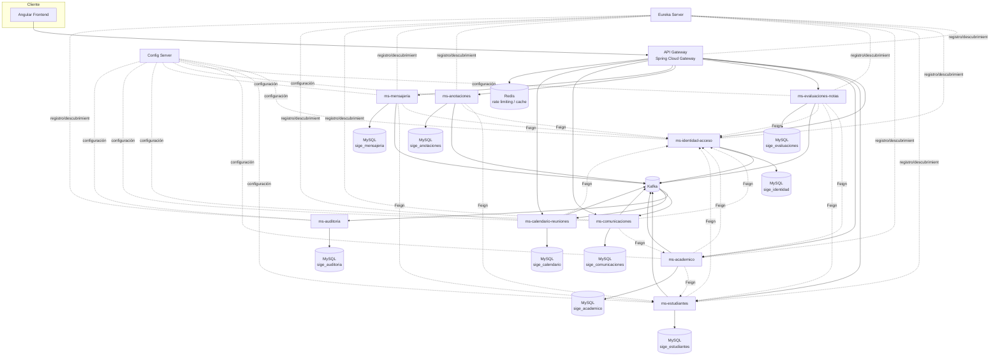
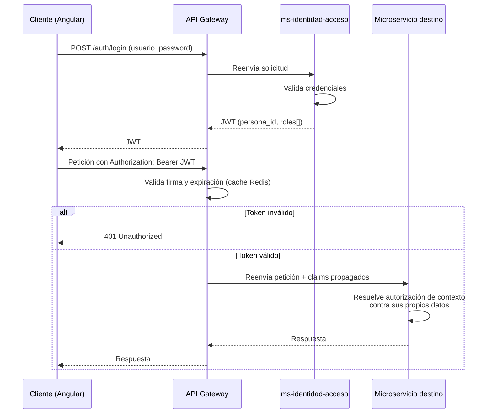

# Arquitectura de Microservicios
## Plataforma SIGE Escolar

**Fuente de verdad:** `SIGE-dominio-consolidado.md` (Fase 1, análisis de dominio) y `MODELO_LOGICO_BD.md` (28 entidades). Este documento no reabre decisiones de dominio — las traduce en límites de servicio.

**Principio rector:** los microservicios se agrupan por **bounded context** (alta cohesión de negocio, bajo acoplamiento entre contextos), no por entidad individual. Las 28 entidades del modelo lógico se distribuyen en **9 microservicios de dominio**, no en 28 servicios.

---

## 1. Decisiones de diseño relevantes

Antes de justificar cada servicio, se documentan las decisiones estructurales que no son obvias por simple lectura del modelo lógico — mismo criterio de transparencia usado en los documentos anteriores.

### 1.1 Matrícula se integra al bounded context de Estructura Académica (no es un servicio aparte)

**Alternativa considerada:** aislar `Matrícula` en un microservicio propio ("Enrollment Service"), separado de Curso/Periodo/Asignatura/AsignaciónDocente.

**Decisión:** se descarta esa separación. Matrícula se modela dentro del mismo servicio que Curso, Periodo Académico, Subperiodo, Asignatura y Asignación Docente (`ms-academico`).

**Justificación:** casi toda escritura o lectura de Matrícula requiere datos de Curso en el mismo instante (validar curso vigente, periodo, cupo futuro, etc.), y casi toda consulta de Curso relevante para otros servicios (evaluaciones, anotaciones) necesita saber qué estudiantes están matriculados. Separarlos en dos servicios distintos generaría llamadas síncronas constantes entre ellos por prácticamente cada operación, sin que exista una razón de negocio para que evolucionen de forma independiente (ambos comparten el mismo ciclo de vida: el periodo académico). Es exactamente el caso que la instrucción del proyecto pide evitar: "no separar servicios únicamente por entidades" cuando la cohesión real está en el proceso de negocio, no en el nombre de la tabla.

### 1.2 Auditoría como servicio 100% asíncrono

`ms-auditoria` **no expone APIs de escritura síncronas** para otros servicios. Cada microservicio publica sus eventos auditables a un tópico Kafka común (`auditoria.eventos`); `ms-auditoria` es el único consumidor. Esto evita que la disponibilidad de todos los servicios del sistema dependa de que `ms-auditoria` esté arriba en el momento de cada escritura — si `ms-auditoria` cae, los eventos se acumulan en Kafka y se procesan al recuperarse, sin bloquear al resto del sistema.

### 1.3 Calendario como agregador con proyección propia (no fan-out síncrono)

`ms-calendario-reuniones` posee sus propias entidades (`Reunión`, `EventoInstitucional`), pero para construir la vista completa del calendario necesita también fechas de Evaluación y de cierre de Periodo/Subperiodo, que pertenecen a otros servicios. En vez de resolver esto con llamadas síncronas a `ms-academico` y `ms-evaluaciones-notas` en cada consulta de calendario (lo cual sería una vista lenta y acoplada a la disponibilidad de dos servicios adicionales), el servicio mantiene una **proyección local de solo lectura**, actualizada de forma asíncrona al consumir eventos (`EvaluacionCreada`, `PeriodoAcademicoCerrado`, `SubperiodoAcademicoCerrado`). Es una aplicación puntual de CQRS: la fuente de verdad de esos datos sigue siendo el servicio dueño; `ms-calendario-reuniones` solo mantiene una copia de lectura desnormalizada para su propio propósito.

### 1.4 Autorización distribuida, no centralizada

`ms-identidad-acceso` **no resuelve permisos de negocio**. Su responsabilidad es autenticar y emitir un JWT con la identidad (`persona_id`) y los roles vigentes (`persona_rol_id` + tipo de rol) de la persona. La pregunta "¿puede este Docente registrar esta Calificación?" se resuelve **dentro de `ms-evaluaciones-notas`**, consultando su propia relación `AsignaciónDocente` — no llamando a `ms-identidad-acceso` para pedir permiso. Esto es la aplicación directa del principio ya cerrado en la Fase 1 (sección 5.1): "Rol activo + relación de contexto + acción permitida", donde la relación de contexto vive en el servicio dueño del dato, no en un servicio central de permisos.

### 1.5 Bases de datos propias, sin acceso cruzado

Cada microservicio tiene su propia base de datos MySQL. Las referencias a entidades de otro servicio (ej. `estudiante_id` dentro de `ms-evaluaciones-notas`) se almacenan como **identificadores sin clave foránea real** — la integridad se garantiza mediante validación síncrona (Feign) al momento de escritura, o se acepta consistencia eventual en flujos donde no es crítico (ver sección 5 y 6).

---

## 2. Diagrama de alto nivel

---

## 3. Lista de microservicios

| # | Servicio | Bounded Context |
|---|---|---|
| 1 | `ms-identidad-acceso` | Identidad, Roles y Autenticación |
| 2 | `ms-estudiantes` | Estudiantes y Apoderados |
| 3 | `ms-academico` | Estructura Académica y Matrícula |
| 4 | `ms-evaluaciones-notas` | Evaluación y Calificación |
| 5 | `ms-anotaciones` | Convivencia y Seguimiento Conductual |
| 6 | `ms-mensajeria` | Comunicación Directa (Conversaciones) |
| 7 | `ms-comunicaciones` | Comunicación Institucional y Notificaciones |
| 8 | `ms-calendario-reuniones` | Calendario y Reuniones |
| 9 | `ms-auditoria` | Trazabilidad Transversal |

Componentes de infraestructura (no son bounded contexts de negocio): API Gateway, Eureka Server, Config Server, Kafka, Redis.

---

## 4. Componentes de infraestructura

### 4.1 API Gateway (Spring Cloud Gateway)
Punto único de entrada para el frontend Angular. Responsabilidades:
- Enrutamiento a cada microservicio, resuelto vía Eureka (sin URLs fijas).
- Validación de JWT en el borde del sistema: rechaza tokens inválidos/expirados antes de que la petición llegue a cualquier microservicio.
- Rate limiting por usuario/IP, apoyado en Redis.
- Punto único de CORS para el frontend.

### 4.2 Eureka Server (Service Discovery)
Registro dinámico de instancias. Todos los microservicios (incluido el Gateway) se registran al iniciar. Los clientes Feign resuelven el nombre lógico del servicio (ej. `ms-estudiantes`) contra Eureka, no contra una IP/puerto fijo — necesario para escalar instancias horizontalmente sin reconfigurar a mano.

### 4.3 Config Server (Spring Cloud Config)
Configuración centralizada por servicio y por entorno (dev/prod), respaldada en un repositorio Git. Evita `application.yml` dispersos y permite rotar configuración (ej. credenciales de Kafka) sin reconstruir imágenes Docker.

### 4.4 Kafka
Bus de eventos de dominio. Dos usos diferenciados en esta arquitectura:
- **Eventos de dominio específicos** (ej. `CalificacionRegistrada`, `AnotacionCreada`) — consumidos por servicios interesados en reaccionar (`ms-comunicaciones`, `ms-calendario-reuniones`).
- **Tópico transversal de auditoría** (`auditoria.eventos`) — consumido exclusivamente por `ms-auditoria`.

### 4.5 Redis
- Cache de validación de JWT en el Gateway (evita recomputar validaciones para el mismo token en ráfagas de peticiones).
- Rate limiting (contador por usuario/IP).
- Cache de la proyección de calendario en `ms-calendario-reuniones` (lectura frecuente, escritura poco frecuente).

---

## 5. Microservicios de dominio

### 5.1 `ms-identidad-acceso`

**Responsabilidad:** gestionar la identidad única de las personas del establecimiento, sus roles y la autenticación. Es el único servicio que conoce credenciales.

**Bounded Context:** Identidad y Acceso — deliberadamente reducido: no conoce reglas académicas, conductuales ni de mensajería, solo "quién es esta persona y qué roles tiene vigentes".

**Entidades que le pertenecen:** `PERSONA`, `ROL`, `PERSONA_ROL`.

**Justificación de pertenencia:**
- `PERSONA` es, por definición, la raíz de identidad — no puede vivir en ningún otro servicio sin generar una fuente de verdad duplicada (el mismo riesgo que ya se corrigió en el modelo de dominio para "Historial académico").
- `ROL` es un catálogo cerrado directamente asociado a la gestión de identidad/permisos.
- `PERSONA_ROL` resuelve la asignación de rol y es el dato que **todos los demás servicios referencian por ID** (nunca por FK real) para saber "bajo qué rol actúa esta persona" — debe vivir junto a Persona porque su ciclo de vida (activar/desactivar un rol) es una decisión de identidad, no de negocio académico.

**APIs públicas (representativas):**
- `POST /auth/login` — autenticación, emite JWT.
- `POST /auth/refresh` — renovación de token.
- `GET /personas/{id}` — datos de identidad básicos.
- `GET /personas/{id}/roles` — roles vigentes de una persona.
- `POST /personas` / `POST /personas/{id}/roles` — alta de persona y asignación de rol (uso administrativo).

**Eventos que publica:** `PersonaCreada`, `RolAsignado`, `RolRevocado`.

**Eventos que consume:** ninguno — es un servicio fundacional, no reacciona a eventos de otros contextos.

**Dependencias con otros servicios:** ninguna saliente. Es el servicio con menor acoplamiento de salida, consistente con ser la base de identidad de todo el sistema.

**Base de datos:** `sige_identidad` (MySQL).

---

### 5.2 `ms-estudiantes`

**Responsabilidad:** gestionar la identidad académica del estudiante (independiente de si está matriculado), su información sensible, y la relación con sus apoderados.

**Bounded Context:** Estudiantes y Familia — distinto del contexto de Identidad porque agrega semántica de negocio propia (información sensible, relación de apoderado) que no es responsabilidad de `ms-identidad-acceso`.

**Entidades que le pertenecen:** `ESTUDIANTE`, `INFORMACION_SENSIBLE_ESTUDIANTE`, `APODERADO`, `APODERADO_ESTUDIANTE`.

**Justificación de pertenencia:**
- `ESTUDIANTE` y `APODERADO` son especializaciones de `PERSONA_ROL`, pero su comportamiento de negocio (información sensible, relación N:M con tipo principal/secundario) es ajeno a lo que le compete a Identidad — separarlas evita que `ms-identidad-acceso` termine absorbiendo reglas de negocio de todos los módulos que usan roles.
- `INFORMACION_SENSIBLE_ESTUDIANTE` vive junto a `ESTUDIANTE` porque ambas comparten el mismo perímetro de protección de datos (Fase 1, capa de autorización): quien puede leer una, típicamente necesita resolverse contra la misma fuente.
- `APODERADO_ESTUDIANTE` es la relación de contexto que **otros servicios consultan constantemente** para resolver autorización (ej. "¿este Apoderado puede ver esta Calificación?") — debe vivir donde vive el resto de la relación Apoderado-Estudiante, no fragmentarse.

**APIs públicas (representativas):**
- `GET /estudiantes/{id}` — identidad académica del estudiante.
- `GET /estudiantes/{id}/informacion-sensible` — acceso restringido (validado a nivel de aplicación contra la capa de autorización).
- `GET /apoderados/{id}/estudiantes` — estudiantes asociados a un apoderado.
- `POST /apoderados/{id}/estudiantes/{estudianteId}` — crear relación apoderado-estudiante.

**Eventos que publica:** `EstudianteCreado`, `ApoderadoEstudianteAsociado`.

**Eventos que consume:** `RolAsignado` (de `ms-identidad-acceso`, filtrando por rol=Estudiante/Apoderado, para saber cuándo debe crear la especialización correspondiente).

**Dependencias con otros servicios:** `ms-identidad-acceso` (Feign, validar que el `persona_rol_id` referenciado existe y corresponde al rol esperado antes de crear la especialización).

**Base de datos:** `sige_estudiantes` (MySQL).

---

### 5.3 `ms-academico`

**Responsabilidad:** gestionar la estructura curricular del establecimiento (niveles, periodos, cursos, asignaturas), la asignación de docentes, y el ciclo de vida de las matrículas.

**Bounded Context:** Estructura Académica y Matrícula — el contexto más grande del sistema en número de entidades, justificado en la sección 1.1: todas comparten el mismo eje temporal (Periodo Académico) y se consultan conjuntamente en casi cualquier operación.

**Entidades que le pertenecen:** `NIVEL_EDUCATIVO`, `PERIODO_ACADEMICO`, `SUBPERIODO_ACADEMICO`, `CURSO`, `ASIGNATURA`, `ASIGNACION_DOCENTE`, `MATRICULA`.

**Justificación de pertenencia:**
- `NIVEL_EDUCATIVO`, `PERIODO_ACADEMICO` y `SUBPERIODO_ACADEMICO` son la base temporal/curricular de la que dependen `Curso` y, transitivamente, casi todo lo demás — separarlas en otro servicio obligaría a `Curso` a resolver por Feign datos que necesita en cada operación de escritura.
- `CURSO` y `ASIGNATURA` son el catálogo académico propiamente tal.
- `ASIGNACION_DOCENTE` vive aquí porque su vigencia está intrínsecamente ligada al Curso y al Periodo — no a la identidad del Docente (que sigue viviendo en `ms-identidad-acceso`, referenciada por `persona_rol_id`).
- `MATRICULA` vive aquí por la decisión ya justificada en la sección 1.1.

**APIs públicas (representativas):**
- `GET /cursos/{id}` / `GET /cursos?periodo={id}`
- `POST /asignaciones-docente` / `PATCH /asignaciones-docente/{id}` (finalizar vigencia)
- `POST /matriculas` — crear matrícula (valida contra `ms-estudiantes`).
- `PATCH /matriculas/{id}/cambiar-curso` — orquesta finalizar matrícula activa + crear nueva.
- `PATCH /periodos/{id}/cerrar` / `PATCH /subperiodos/{id}/cerrar`.

**Eventos que publica:** `CursoCreado`, `AsignacionDocenteCreada`, `AsignacionDocenteFinalizada`, `MatriculaCreada`, `MatriculaCambioEstado`, `PeriodoAcademicoCerrado`, `SubperiodoAcademicoCerrado`.

**Eventos que consume:** ninguno de otro contexto de negocio (es, junto con Identidad y Estudiantes, un servicio "fuente" más que "reactivo").

**Dependencias con otros servicios:** `ms-identidad-acceso` (Feign, validar `persona_rol_id` del docente/profesor jefe), `ms-estudiantes` (Feign, validar `estudiante_id` al crear una Matrícula).

**Base de datos:** `sige_academico` (MySQL).

---

### 5.4 `ms-evaluaciones-notas`

**Responsabilidad:** gestionar evaluaciones, calificaciones y el flujo de excepción post-cierre.

**Bounded Context:** Evaluación Académica — un dominio con reglas propias suficientemente complejas (ponderación, cierre por subperiodo, flujo de excepción con aprobación) como para justificar aislamiento del resto de lo académico.

**Entidades que le pertenecen:** `EVALUACION`, `CALIFICACION`, `SOLICITUD_EXCEPCION_CALIFICACION`.

**Justificación de pertenencia:** las tres comparten el mismo ciclo de vida y las mismas reglas de negocio (apertura/cierre de subperiodo, excepción controlada) — separarlas fragmentaría un proceso de negocio único (registrar y, excepcionalmente, corregir una nota) en más de un servicio sin ninguna ganancia de cohesión.

**APIs públicas (representativas):**
- `POST /evaluaciones` (requiere Asignación Docente vigente, validada por Feign).
- `POST /calificaciones` / `PATCH /calificaciones/{id}`.
- `POST /solicitudes-excepcion-calificacion` / `PATCH /solicitudes-excepcion-calificacion/{id}/resolver`.
- `GET /estudiantes/{id}/calificaciones` (usado por Reportes, a futuro).

**Eventos que publica:** `EvaluacionCreada`, `CalificacionRegistrada`, `CalificacionModificada`, `SolicitudExcepcionCalificacionCreada`, `SolicitudExcepcionCalificacionResuelta`.

**Eventos que consume:** `SubperiodoAcademicoCerrado` (de `ms-academico`, para bloquear escritura directa de calificaciones y exigir excepción).

**Dependencias con otros servicios:** `ms-academico` (Feign, validar `asignacion_docente_id` vigente y estado del `subperiodo_academico_id`), `ms-estudiantes` (Feign, validar `estudiante_id`), `ms-identidad-acceso` (Feign, validar que el aprobador de una excepción tiene rol Directivo vigente).

**Base de datos:** `sige_evaluaciones` (MySQL).

---

### 5.5 `ms-anotaciones`

**Responsabilidad:** gestionar el registro histórico de anotaciones (académicas, positivas, negativas con gravedad) de los estudiantes.

**Bounded Context:** Convivencia y Seguimiento Conductual — deliberadamente separado de Evaluación/Notas, porque las reglas de acceso son distintas (Inspector tiene acceso transversal aquí, pero no a notas) y porque conceptualmente son procesos de negocio independientes, ya diferenciados desde la Fase 1.

**Entidades que le pertenecen:** `ANOTACION`.

**Justificación de pertenencia:** es la única entidad de este contexto, pero se mantiene como servicio propio (no se fusiona con Evaluaciones ni con Estudiantes) porque su perfil de acceso y sus actores principales (Inspector, Profesor Jefe) son suficientemente distintos como para no compartir base de datos con información académica o de identidad sensible — aislarla reduce el radio de exposición si este servicio específico sufriera un incidente de seguridad.

**APIs públicas (representativas):**
- `POST /anotaciones` / `PATCH /anotaciones/{id}/anular`.
- `GET /estudiantes/{id}/anotaciones` (usado también para construir la "hoja de vida", que sigue siendo una vista, no una entidad, ahora resuelta a nivel de este servicio).

**Eventos que publica:** `AnotacionCreada`, `AnotacionAnulada`.

**Eventos que consume:** ninguno.

**Dependencias con otros servicios:** `ms-estudiantes` (Feign, validar `estudiante_id`), `ms-identidad-acceso` (Feign, validar `persona_rol_id` del autor y su rol).

**Base de datos:** `sige_anotaciones` (MySQL).

---

### 5.6 `ms-mensajeria`

**Responsabilidad:** gestionar conversaciones, mensajes y el flujo de acceso excepcional a conversaciones privadas.

**Bounded Context:** Comunicación Directa — distinto de Comunicaciones Institucionales (Comunicado/Notificación), porque la mensajería es bidireccional, privada y con reglas de participación estrictas, mientras que Comunicado/Notificación son unidireccionales y de alcance amplio.

**Entidades que le pertenecen:** `CONVERSACION`, `MENSAJE`, `CONVERSACION_PARTICIPANTE`, `SOLICITUD_ACCESO_CONVERSACION`.

**Justificación de pertenencia:** todas resuelven el mismo proceso de negocio (comunicación privada y su excepción de acceso controlado) — separarlas replicaría el mismo error que se evitó con Matrícula (fragmentar un único proceso de negocio en varios servicios sin necesidad).

**APIs públicas (representativas):**
- `POST /conversaciones` (valida reglas de quién puede iniciar contacto con quién).
- `POST /conversaciones/{id}/mensajes`.
- `POST /solicitudes-acceso-conversacion` / `PATCH /solicitudes-acceso-conversacion/{id}/resolver`.

**Eventos que publica:** `ConversacionIniciada`, `MensajeEnviado`, `SolicitudAccesoConversacionCreada`, `SolicitudAccesoConversacionResuelta`.

**Eventos que consume:** ninguno.

**Dependencias con otros servicios:** `ms-identidad-acceso` (Feign, validar personas/roles), `ms-estudiantes` (Feign, validar relación Apoderado-Estudiante al autorizar el inicio de una conversación), `ms-academico` (Feign, validar Asignación Docente vigente al autorizar Docente↔Apoderado).

**Base de datos:** `sige_mensajeria` (MySQL).

---

### 5.7 `ms-comunicaciones`

**Responsabilidad:** publicar comunicados institucionales y generar/entregar notificaciones a partir de eventos de otros servicios.

**Bounded Context:** Comunicación Institucional y Notificaciones — un "subdominio genérico" en términos DDD: no encierra una regla de negocio única y compleja, sino un servicio de soporte transversal que traduce eventos del sistema en mensajes hacia los usuarios.

**Entidades que le pertenecen:** `COMUNICADO`, `NOTIFICACION`.

**Justificación de pertenencia:** ambas comparten el mismo propósito técnico (entregar información a un destinatario, con estado de lectura) aunque su origen sea distinto (Comunicado es contenido creado manualmente; Notificación se genera a partir de eventos) — separarlas en dos servicios distintos duplicaría la infraestructura de "entrega y seguimiento de lectura" sin beneficio de negocio.

**APIs públicas (representativas):**
- `POST /comunicados` — publicar comunicado.
- `GET /personas/{id}/notificaciones` — bandeja de notificaciones.
- `PATCH /notificaciones/{id}/marcar-leida`.

**Eventos que publica:** `ComunicadoPublicado`.

**Eventos que consume:** `AnotacionCreada`, `EvaluacionCreada`, `CalificacionRegistrada`, `SolicitudExcepcionCalificacionResuelta`, `SolicitudAccesoConversacionResuelta`, `ReunionCreada`, `MatriculaCambioEstado` — es el servicio con **mayor número de eventos consumidos**, consistente con ser el punto de convergencia de la Notificación transversal ya definida en el dominio (Fase 1, sección 3.15).

**Dependencias con otros servicios:** `ms-identidad-acceso` (Feign, validar emisor de un Comunicado), `ms-academico` (Feign, validar alcance de curso/nivel del Comunicado).

**Base de datos:** `sige_comunicaciones` (MySQL).

---

### 5.8 `ms-calendario-reuniones`

**Responsabilidad:** gestionar reuniones, eventos institucionales, y exponer la vista consolidada de calendario.

**Bounded Context:** Calendario y Reuniones.

**Entidades que le pertenecen:** `EVENTO_INSTITUCIONAL`, `REUNION`, `REUNION_PARTICIPANTE`. Adicionalmente mantiene una **proyección de solo lectura** (no forma parte del modelo lógico de negocio, es infraestructura de este servicio) con fechas de Evaluación y cierres de Periodo/Subperiodo, poblada vía eventos — ver decisión 1.3.

**Justificación de pertenencia:** Reunión y EventoInstitucional son las únicas entidades "propias" del calendario según el cierre de la Fase 1.8 (Calendario es proyección, no entidad) — el servicio refleja exactamente esa decisión de dominio.

**APIs públicas (representativas):**
- `POST /reuniones` (valida quién puede convocar cada tipo, contra Asignación Docente/Profesor Jefe vía Feign).
- `PATCH /reuniones/{id}/estado`.
- `GET /calendario?desde=&hasta=` — vista consolidada (combina entidades propias + proyección local).

**Eventos que publica:** `ReunionCreada`, `ReunionCancelada`, `EventoInstitucionalCreado`.

**Eventos que consume:** `EvaluacionCreada` (de `ms-evaluaciones-notas`), `PeriodoAcademicoCerrado`, `SubperiodoAcademicoCerrado` (de `ms-academico`) — para mantener la proyección local del calendario.

**Dependencias con otros servicios:** `ms-identidad-acceso` (Feign, validar convocante/participantes), `ms-academico` (Feign, validar que el convocante tiene la relación de contexto requerida — ej. Profesor Jefe del curso).

**Base de datos:** `sige_calendario` (MySQL).

---

### 5.9 `ms-auditoria`

**Responsabilidad:** persistir el registro histórico de acciones auditables de todo el sistema.

**Bounded Context:** Trazabilidad Transversal — no contiene reglas de negocio propias del dominio educativo; es un servicio de soporte, deliberadamente simple y con una única responsabilidad técnica.

**Entidades que le pertenecen:** `REGISTRO_AUDITORIA`.

**Justificación de pertenencia:** es la única entidad verdaderamente transversal del modelo lógico (referencia genérica a cualquier otra entidad, ver `MODELO_LOGICO_BD.md`, Decisión de transformación #5) — no pertenece de forma natural a ningún bounded context de negocio específico, por lo que se aísla en su propio servicio de soporte.

**APIs públicas (representativas):**
- `GET /auditoria?entidad_tipo=&entidad_id=` — consulta de trazabilidad (uso administrativo/Directivo).
- **No expone endpoints de escritura** — el registro se crea exclusivamente al consumir eventos (ver 1.2).

**Eventos que publica:** ninguno.

**Eventos que consume:** todos los eventos publicados al tópico `auditoria.eventos` por el resto de los servicios (contrato común: `persona_id`, `rol_activo_persona_rol_id`, `accion`, `entidad_afectada_tipo`, `entidad_afectada_id`, `valor_anterior`, `valor_nuevo`, `motivo`).

**Dependencias con otros servicios:** ninguna síncrona — es, junto con `ms-identidad-acceso`, uno de los dos servicios sin llamadas Feign salientes, pero por la razón opuesta (Identidad no necesita datos de nadie; Auditoría deliberadamente evita depender de la disponibilidad de nadie).

**Base de datos:** `sige_auditoria` (MySQL).

---

## 6. Comunicación síncrona (REST / OpenFeign) — resumen

| Servicio origen | Servicio destino | Propósito |
|---|---|---|
| ms-estudiantes | ms-identidad-acceso | Validar persona_rol_id al crear Estudiante/Apoderado |
| ms-academico | ms-identidad-acceso | Validar persona_rol_id de Docente/Profesor Jefe |
| ms-academico | ms-estudiantes | Validar estudiante_id al crear Matrícula |
| ms-evaluaciones-notas | ms-academico | Validar Asignación Docente vigente y estado del Subperiodo |
| ms-evaluaciones-notas | ms-estudiantes | Validar estudiante_id |
| ms-evaluaciones-notas | ms-identidad-acceso | Validar rol Directivo del aprobador de excepción |
| ms-anotaciones | ms-estudiantes | Validar estudiante_id |
| ms-anotaciones | ms-identidad-acceso | Validar rol del autor |
| ms-mensajeria | ms-identidad-acceso | Validar personas/roles participantes |
| ms-mensajeria | ms-estudiantes | Validar relación Apoderado-Estudiante |
| ms-mensajeria | ms-academico | Validar Asignación Docente vigente (contexto Docente↔Apoderado) |
| ms-comunicaciones | ms-identidad-acceso | Validar emisor del Comunicado |
| ms-comunicaciones | ms-academico | Validar alcance (curso/nivel) del Comunicado |
| ms-calendario-reuniones | ms-identidad-acceso | Validar convocante/participantes |
| ms-calendario-reuniones | ms-academico | Validar relación de contexto del convocante |

**Nota de diseño:** todas las llamadas síncronas son de **validación en escritura** (¿existe X, es válido X?), no de lectura para construir respuestas — evita que un servicio dependa de otro para responder sus propias consultas de lectura, reduciendo acoplamiento en el camino más frecuente (lecturas).

---

## 7. Comunicación asíncrona (Kafka) — catálogo de eventos

| Tópico / Evento | Productor | Consumidor(es) |
|---|---|---|
| `PersonaCreada` | ms-identidad-acceso | ms-estudiantes (indirectamente, vía RolAsignado) |
| `RolAsignado` / `RolRevocado` | ms-identidad-acceso | ms-estudiantes |
| `EstudianteCreado` | ms-estudiantes | (reservado para futuros consumidores, ej. Reportes) |
| `ApoderadoEstudianteAsociado` | ms-estudiantes | (reservado) |
| `CursoCreado` | ms-academico | (reservado) |
| `AsignacionDocenteCreada` / `Finalizada` | ms-academico | (reservado) |
| `MatriculaCreada` / `MatriculaCambioEstado` | ms-academico | ms-comunicaciones |
| `PeriodoAcademicoCerrado` | ms-academico | ms-calendario-reuniones |
| `SubperiodoAcademicoCerrado` | ms-academico | ms-evaluaciones-notas, ms-calendario-reuniones |
| `EvaluacionCreada` | ms-evaluaciones-notas | ms-comunicaciones, ms-calendario-reuniones |
| `CalificacionRegistrada` / `Modificada` | ms-evaluaciones-notas | ms-comunicaciones |
| `SolicitudExcepcionCalificacionCreada` / `Resuelta` | ms-evaluaciones-notas | ms-comunicaciones |
| `AnotacionCreada` / `Anulada` | ms-anotaciones | ms-comunicaciones |
| `ConversacionIniciada` / `MensajeEnviado` | ms-mensajeria | (reservado) |
| `SolicitudAccesoConversacionCreada` / `Resuelta` | ms-mensajeria | ms-comunicaciones |
| `ComunicadoPublicado` | ms-comunicaciones | (reservado) |
| `ReunionCreada` / `Cancelada` | ms-calendario-reuniones | ms-comunicaciones |
| `auditoria.eventos` (contrato común) | Todos los servicios de dominio | ms-auditoria (único consumidor) |

**Nota:** varios eventos quedan marcados como "reservado" — se publican desde el día uno (buena práctica de diseño orientado a eventos), aunque hoy no tengan consumidor. Esto evita tener que modificar el servicio productor cuando en el futuro se agregue, por ejemplo, un servicio de Reportes.

---

## 8. Flujo de autenticación

**Detalle:**
1. `ms-identidad-acceso` actúa como emisor de JWT (Authorization Server simplificado) — para el alcance de v1 no se integra un proveedor OAuth2 externo; se deja como evolución futura si el establecimiento requiere login federado (ej. Google Workspace institucional), consistente con no sobrediseñar.
2. El JWT incluye `persona_id` y la lista de `persona_rol_id` con su tipo de rol vigente — **no** incluye permisos específicos (esos se resuelven por servicio, ver decisión 1.4).
3. El Gateway valida el token en el borde (firma + expiración) y cachea el resultado en Redis para evitar validaciones repetidas en ráfagas de peticiones del mismo usuario.
4. Cada microservicio destino confía en los claims propagados por el Gateway, pero **siempre** resuelve la autorización específica de la acción contra su propia base de datos (ej. `ms-evaluaciones-notas` verifica la Asignación Docente, no confía en que "ser Docente" alcance por sí solo).

---

## 9. Consideraciones de despliegue

- **Docker Compose** orquesta: 9 microservicios de dominio + Gateway + Eureka + Config Server + Kafka (+ Zookeeper o modo KRaft) + Redis + 9 instancias/esquemas MySQL.
- **Flyway** en cada microservicio gestiona su propio esquema — no existe un script de base de datos compartido entre servicios, consistente con "una base de datos por microservicio".
- Cada servicio expone su propio `Dockerfile` y se registra en Eureka al iniciar; el Gateway y los clientes Feign no requieren reconfiguración al escalar instancias.
- El orden de arranque relevante para desarrollo local: Config Server y Eureka primero, luego Kafka, luego los microservicios de dominio (que dependen de Eureka y Config Server para arrancar correctamente), y finalmente el Gateway.

---

## 10. Riesgos y próximos pasos antes de codificar

- **Consistencia eventual entre servicios:** al no existir FKs reales entre bases de datos, es posible (aunque de baja probabilidad, dado que las validaciones de escritura son síncronas) que un dato referenciado deje de existir después de la validación inicial. Se acepta este riesgo para el alcance del proyecto, documentado explícitamente en vez de ignorado.
- **`ms-academico` concentra 7 entidades** — es el servicio de mayor tamaño relativo. Se justificó por cohesión (sección 1.1), pero conviene vigilar su crecimiento: si en el futuro Matrícula desarrolla reglas de negocio propias mucho más complejas que las de Curso/Asignatura, la decisión de fusión debería revisarse.
- **Contrato común de evento de auditoría** (sección 5.9) debe definirse formalmente (esquema Avro/JSON Schema) antes de implementar el primer productor, para que los 8 servicios de dominio lo cumplan de forma consistente desde el inicio.
- **Pendientes de dominio no bloqueantes** (Fase 1, sección 6: transiciones de estado de Matrícula, catálogo completo de eventos de Notificación, granularidad exacta del cierre académico) no bloquean esta arquitectura, pero sí deberán resolverse antes de implementar la lógica interna de `ms-academico`, `ms-comunicaciones` y `ms-evaluaciones-notas` respectivamente.

**Este documento queda a la espera de tu validación antes de comenzar la implementación de cualquier microservicio.**
